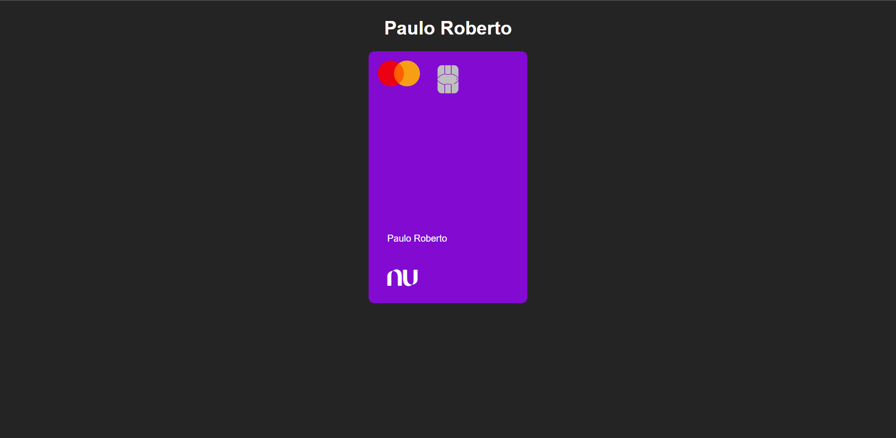

# Projeto do Cartao NuBank

[Acesse](https://prdsilva80.github.io/cartao-nubank/)

# 🛠️ Tecnologias ultilizadas

     

# 👨‍🎓 O que aprendi

- Usei mais o CSS para dar forma ao projeto
- Aprendi a fazer animações com o JavaScript
- Aprimorando o uso das tecnologias

# 📧 Contato

- probertos717@gmail.com